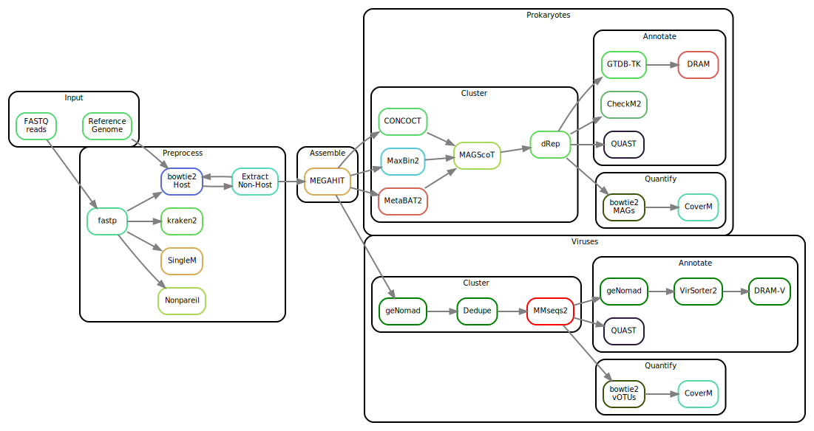

[](https://github.com/3d-omics/mg_assembly/actions)


# Snakemake workflow: `mg_assembly`

A Snakemake workflow for Genome Resolved Metagenomics

## Features
- FASTQ processing with `fastp`.
- Mapping of preprocessed reads against the host(s) with `bowtie2`. Skip if no host is provided.
- Assembly-free statistics with `kraken2`, `nonpareil` and `singlem`.
- Assembly of non-host reads with `megahit`.
- Bacterial metagenomics: 
  - Binning with CONCOCT, Maxbin2, MetaBAT2, and aggregated with MAGScoT.
  - Dereplication with `dRep`
  - Quantification with `bowtie2` and `coverm`
  - Annotation with `quast`, `gtdbtk` and `dram`
- Viral metagenomics:
  - Identification and clustering with `genomad`, 
- Reporting with `samtools`, `fastqc` and `multiqc`


## Usage
1. Make sure you have `conda`, `mamba` and `snakemake` installed.
    ```bash
    conda --version
    snakemake --version
    mamba --version
    ```

2. Clone the git repository in your terminal and get in:
    ```bash
    git clone git@github.com:3d-omics/mg_assembly.git
    cd mg_assembly
    ```

3. Test your installation by running the test data. It will download all the necesary software through conda / mamba. It should take less than 5 minutes.
    ```bash
    .github/workflows/test.sh
    ```

4. Run it with your own data:

   1. Edit `config/samples.tsv` and add your samples names, a library identifier to differentiate them, where are they located, the adapters used, and the coassemblies each sample will belong to.

    ```tsv
    sample_id	library_id	forward_filename	reverse_filename	forward_adapter	reverse_adapter	assembly_ids
    sample1	lib1	resources/reads/sample1_1.fq.gz	resources/reads/sample1_2.fq.gz	AGATCGGAAGAGCACACGTCTGAACTCCAGTCA	AGATCGGAAGAGCGTCGTGTAGGGAAAGAGTGT	sample, all
    sample2	lib1	resources/reads/sample2_1.fq.gz	resources/reads/sample2_2.fq.gz	AGATCGGAAGAGCACACGTCTGAACTCCAGTCA	AGATCGGAAGAGCGTCGTGTAGGGAAAGAGTGT	all
    ```

    2. Edit `config/features.yml` with reference databases:

    ```yaml
    hosts:  # Add more in case of multi-host, remove entries in case of environmental sample
      chicken: resources/reference/chicken_39_sub.fa.gz
      # pig: resources/reference/pig.fa.gz

    magscot:
      pfam_hmm: workflow/scripts/MAGScoT/hmm/gtdbtk_rel207_Pfam-A.hmm.gz
      tigr_hmm: workflow/scripts/MAGScoT/hmm/gtdbtk_rel207_tigrfam.hmm.gz

    databases:  # The pipeline does not provide or generate them
      checkm2: resources/databases/checkm2/20210323/uniref100.KO.1.dmnd
      checkv: resources/databases/checkv/20230320/checkv-db-v1.5/
      dram: resources/databases/dram/20230811
      genomad: resources/databases/genomad/genomad_db_v1.7
      gtdbtk: resources/databases/gtdbtk/release214
      kraken2:  # add entries as necessary
        refseq500: resources/databases/kraken2/kraken2_RefSeqV205_Complete_500GB/20220505/
      singlem: resources/databases/singlem/S3.2.1.GTDB_r214.metapackage_20231006.smpkg.zb
      virsorter2: resources/databases/virsorter2/20200511/
    ```

    3. Edit `config/params.yml` with execution parameters. The defaults are reasonable.


5. Run the pipeline
     ```
     # make sure firsthand that you have all the databases above properly installed
     snakemake --use-conda --jobs 8  # locally
     snakemake --use-conda --profile profile/default --cores 24 --jobs 100 --executor slurm  # in slurm
     ```


6. Output:
  
    The main outputs are:
    1. `results/prokaryotes/cluster/drep/dereplicated_genomes.fa.gz`: all the assembled MAGs.
    2. `results/prokaryotes/annotate/`: the different annotations.
    3. `results/prokaryotes/quantify/`: MAG and contig-wise quantifications.
    4. There is an experimental pipeline for viral identification with a similar structure. Seel below.
    5. MultiQC html reports and tables in `reports`, step and sample-wise.


## Rulegraph




## References

- Preprocess
  - [`fastp`](https://github.com/OpenGene/fastp)
  - [`kraken2`](https://github.com/DerrickWood/kraken2)
  - [`SingleM`](https://github.com/wwood/singlem)
  - [`Nonpareil`](https://github.com/lmrodriguezr/nonpareil)
  - [`bowtie2`](https://github.com/BenLangmead/bowtie2)
  - [`samtools`](https://github.com/samtools/samtools)

- Assemble
  - [`MEGAHIT`](https://github.com/voutcn/megahit)

- Prokaryotes
  - [`CONCOCT`](https://github.com/BinPro/CONCOCT)
  - [`MaxBin2`](http://downloads.jbei.org/data/microbial_communities/MaxBin/MaxBin.html)
  - [`MetaBat2`](https://bitbucket.org/berkeleylab/metabat)
  - [`MAGScoT`](https://github.com/ikmb/MAGScoT)
  - [`dRep`](https://github.com/MrOlm/drep)
  - [`QUAST`](https://github.com/ablab/quast)
  - [`GTDB-TK`](https://github.com/Ecogenomics/GTDBTk)
  - [`DRAM`](https://github.com/WrightonLabCSU/DRAM)
  - [`CoverM`](https://github.com/wwood/CoverM)

- Viruses
  - [`genomad`](https://github.com/apcamargo/genomad)
  - [`bbmap`](https://sourceforge.net/projects/bbmap/)
  - [`mmseqs2`](https://github.com/soedinglab/MMseqs2)
  - [`virsorter2`](https://github.com/jiarong/VirSorter2)
  - [`checkv`](https://bitbucket.org/berkeleylab/checkv/src)

- Report
  - [`FastQC`](https://github.com/s-andrews/FastQC)
  - [`multiqc`](https://github.com/ewels/MultiQC)
